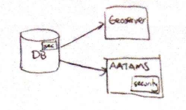
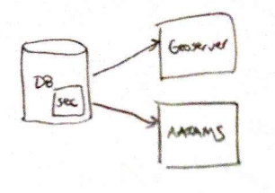
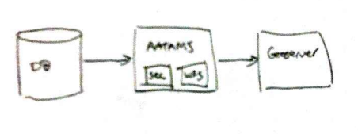
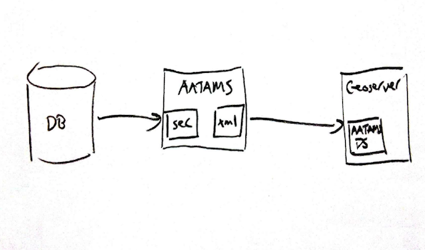
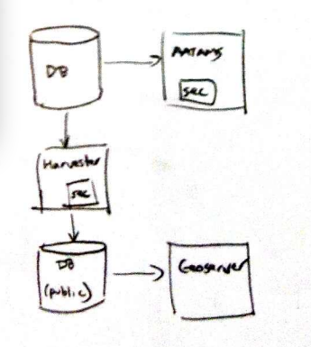

# Requirements

The high-level requirements are:

1. there should be no change to the current web-app behaviour w.r.t. security (with the caveat of the upcoming "protected species" feature);
2. *safe* publishing of AATAMS data with geoserver (for the portal).

# Current Situation

*Note: in the images below, the small boxes contain either the text "sec", "security" or "WFS" (since it's a little hard to read).*

Currently, security is *mostly* handled by the AATAMS web application, with rules based around a user's membership of projects and/or organisations, in combination with certain permission levels applied to individual records (e.g. whether or not a particular release is embargoed).

There is *some* security logic embedded in the database, in the form of "public" views, as well as some preliminary work done by @xhoenner in order to publish geoserver layers.

Advantages:

* N/A!

Disadvantes:

* need to fully implement security logic in two different places (and languages)
* high chance of divergence (and hence broken security/leaked data), even if we get it correct initially

*Note: see [implementation notes](#Implementation Notes) below for more detail on how security is currently implemented.* 

# Alternative Solutions

## Security in DB

Here, *all* of the security logic is pushed down in to the database.

See [filtering table data by user in postgresql](http://blog.easytech.com.ar/2009/02/19/filtering-table-data-by-user-in-postgresql/) for a discussion of how this *might* be achieved w.r.t. keeping the same behaviour in the web app.

Advantages:

* any component connecting to the database will have the same security logic applied
* security logic in one place only
* possibly some performance benefits (since filtering is done *before* shipping data over the wire)

Disadvantages:

* not clear how the technique in the link above would work in relation to grails/hibernate (i.e. setting a `user` run time parameter appropriately for each query)
* a significant amount of security logic has to be ported from the web-app to postgres

## Web App implements WFS

In this scenario, the AATAMS web-app itself would provide certain WFS end-points (e.g. for `detections`, `deployments`).

Geoserver could then be configured to use this as an [External Web Feature Server](http://docs.geoserver.org/stable/en/user/data/cascaded/wfs.html).

Advantages:

* security logic in one place only
* no need to port security logic to database

Disadvantages:

* would have to implement WFS encoders etc in the web app (although, probably using a 3rd party library to do most of the heavy lifting)
* possibly some performance penalties (i.e. latency)

## AATAMS GeoTools Data Source

In this scenario, a custom GeoTools "AATAMS data source" is implemented and added to geoserver, which can the pull data from AATAMS (as opposed to a PostGIS DB or shapefile, for example).

See [this custom data store example](http://docs.geotools.org/stable/tutorials/advanced/datastore.html).

Advantages:

* security logic in one place only
* no need to port security logic to database
* less coding and more flexible that WFS above

Disadvantages:

* XML encoders for AATAMS types
* need to develop geotools plugin and install in geoserver
* performance penalties

## Harvest public data

Here, a scheduled job could harvest public data, which would be the source for geoserver.

Advantages:

* performance benefit, as no security logic would need to be applied at run time
* safer from a security point of view (@pmbohm please elaborate, as this is your claim :-)

Disadvantages:

* "public" data only, no mechanism to see privileged data
* an extra service/harvester to run
* possibly duplicated security logic (although the web app could itself be the harvester)

# Implementation Notes

Various components work together to implement security in the web app currently:

* using `Shiro` plugin as the security framework
* `PermissionUtilsService` - utilities for managing shiro permissions
* `SecSecurityFilters` - controls access to controllers/screens.
* `CandidateEntitiesService` - controls what values appear in certain popups, e.g when creating a *deployment*, on *receivers* for which the user has write access should appear in the drop-down.
* `EmbargoService` - filters out entities which should not be visible to the current user, quite often delegating down to individual domain classes' `isEmbargoed()` methods.
* geographic locations truncated to two decimal places for unauthenticated users.
